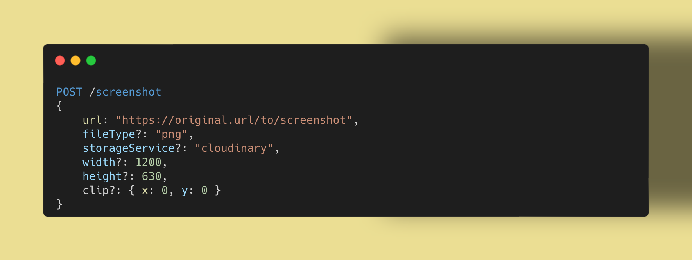

# url-screenshot

A lightweight microservice to generate preview image for web pages

> No dependency on paid cloud services (but doesn't hate them either, supports popular cloud hosting services)




## Installation

This is a simple `Node.js` app. Just run it in any `node >= 20` environment.

It will consume minimal memory and storage footprint. Due to its low usage, I deploy it on the smallest possible AWS EC2 instance where I have couple of more microservices runing.


Make sure to set the configurations as per `env.sample`. The most important one is `SITE_URL`, if not set correctly, you might not be able to access the images saved locally. No trailing slash please.

That's it, you can then start making API requests to get the preview image for any web page. Send a page URL, and it will give you a Screenshot image url which you can add to meta tags such as `og:image`, `twitter:image`, etc. of your page.

Here's set of commands I'd use to set it up

```bash
cp env.sample .env
# Change the configurations you want. At least the SITE_URL
npm install
# Start the app
npm run start:env
# Use of process manager such as pm2 is recommended in production
# Test if it works
curl http://localhost:3000/screenshot -X POST -d '{ "url": "https://gitcommit.show/", "storageService":"cloudinary", "imageId": "test-overwrite", "width": "1200", "height": "630" }'
```

## Usage

To generate screenshot, use the following API

```
POST /screenshot
{
    url: "https://original.url.to.screenshot",
    fileType?: "png",
    storageService?: "cloudinary", // Upload image here after generation, saves to "local" filesystem if not provided
    width?: 1200, 
    height?: 630,
    clip?: { x: 0, y: 0 } // The point on page where to clip the screenshot from
}
```

Response schema

```
{
    screenshot: "https://screenshot.url/permalink.png",
    fileType: "png",
    source: "https://original.url/to/screenshot",
    uploadInfo?: { ...additionalUploadInfoAsReceivedFromTheCloudService }
}
```

## Examples

**Using curl**

A sample `curl` request to generate screenshot for `https://gitcommit.show/`

```bash
curl http://localhost:3000/screenshot -X POST -d '{ "url": "https://example.com/", "storageService":"cloudinary", "imageId": "same-id-will-replace-older-image", "width": "1200", "height": "630" }'
```

**Using Node.js**

```javascript
const fetch = require('node-fetch');
const SCREENSHOT_API_URL = 'http://localhost:3000/screenshot';

const data = {
  url: 'https://example.com/page/1',
  storageService: 'cloudinary',
  imageId: 'unique-for-page-to-allow-easy-updates',
  width: '1200',
  height: '630'
};

fetch(SCREENSHOT_API_URL, {
  method: 'POST',
  headers: {
    'Content-Type': 'application/json'
  },
  body: JSON.stringify(data)
})
  .then(response => response.json())
  .then(responseData => {
    const screenshotImageLink = responseData.screenshot;
    console.log('Preview Image URL:', screenshotImageLink);
    /**
     * You may now use `screenshotImageLink` for `og:image` and `twitter:image` meta tag `content` in your frontend
     * e.g. <meta name="og:image" content="screenshotImageLink">
     * e.g. <meta name="twitter:image" content="screenshotImageLink">
     */
  })
  .catch(error => {
    console.error('Error:', error);
  });
```

## Features

- [x] Generate preview image
- [ ] Upload image to a cloud service
    - [x] Cloudinary
    - [ ] AWS S3
